# ADO Database Relationship Map

This ERD is a navigational map for the canonical relational contract in
`DB_MODEL_SPEC.md`. It groups extension tables around durable parent records.

```mermaid
erDiagram
    ACTOR ||--o{ AUDIT_EVENT : creates
    ACTOR ||--o{ HUMAN_DECISION : makes
    SPEC_LIBRARY_REVISION ||--o{ PROJECT : governs
    ARTIFACT ||--o{ SPEC_LIBRARY_REVISION : manifests
    PROJECT ||--o{ REPOSITORY : owns
    PROJECT ||--o{ COMPONENT : owns
    PROJECT ||--o{ ROADMAP : owns
    PROJECT ||--o{ ARTIFACT : scopes
    PROJECT ||--o{ JOB : scopes
    PROJECT ||--o{ STATE_SUBJECT : scopes
    PROJECT ||--o{ PROJECT_CONSTRAINT_PROFILE : versions
    COMPONENT ||--o{ COMPONENT_REPOSITORY : maps
    REPOSITORY ||--o{ COMPONENT_REPOSITORY : maps
    ROADMAP ||--o{ ROADMAP_SOURCE : has
    ROADMAP ||--o{ FEATURE_UNIT : contains
    FEATURE_UNIT ||--o{ ACCEPTANCE_CRITERION : defines
    FEATURE_UNIT ||--o{ HUMAN_VERIFICATION_ITEM : defines
    FEATURE_UNIT ||--o{ COMPONENT_WORK : groups
    FEATURE_UNIT ||--o{ FEATURE_UNIT_RELATION : relates
    COMPONENT ||--o{ COMPONENT_WORK : implements
    REPOSITORY ||--o{ COMPONENT_WORK : executes_in
    COMPONENT_WORK ||--o{ COMPONENT_WORK_SCOPE : declares
    COMPONENT ||--o{ COMPONENT_WORK_SCOPE : participates_in
    REPOSITORY ||--o{ COMPONENT_WORK_SCOPE : roots_in
    COMPONENT_WORK ||--o{ ALLOWED_PATH_RULE : limits
    COMPONENT_WORK ||--o{ COMPONENT_WORK_RELATION : relates
    COMPONENT_WORK ||--o{ GIT_WORKTREE : owns
    COMPONENT_WORK ||--o{ VERIFICATION_RUN : verifies
    SPEC_LIBRARY_REVISION ||--o{ VERIFICATION_RUN : pins
    COMPONENT_WORK ||--o{ REVIEW_GROUP : reviews
    COMPONENT_WORK ||--o{ REVISION_TASK : revises
    COMPONENT_WORK ||--o{ PULL_REQUEST : proposes
    SPEC_LIBRARY_REVISION ||--o{ PULL_REQUEST : pins
    ARTIFACT ||--o{ ARTIFACT_SOURCE_REF : derives
    ARTIFACT ||--o| DOCUMENT_ARTIFACT : extends
    ARTIFACT ||--o| CONTEXT_PACKET : extends
    ARTIFACT ||--o| REVIEW_PACKET : extends
    SPEC_LIBRARY_REVISION ||--o{ CONTEXT_PACKET : pins
    SPEC_LIBRARY_REVISION ||--o{ REVIEW_PACKET : pins
    JOB ||--o{ JOB_ATTEMPT : retries_as
    JOB ||--o{ JOB_OUTBOX_EVENT : schedules
    JOB_ATTEMPT ||--o{ AGENT_RUN : executes
    SPEC_LIBRARY_REVISION ||--o{ AGENT_RUN : pins
    JOB_ATTEMPT ||--o{ COMMAND_RUN : executes
    VERIFICATION_PROFILE ||--o{ VERIFICATION_COMMAND : contains
    VERIFICATION_PROFILE ||--o{ VERIFICATION_RUN : governs
    VERIFICATION_RUN ||--o{ COMMAND_RUN : records
    REVIEW_GROUP ||--o{ REVIEW_RESULT : contains
    REVIEW_RESULT ||--o{ REVIEW_FINDING : reports
    REVIEW_GROUP ||--o| ARBITER_DECISION : resolves
    REVIEW_FINDING ||--o{ REVISION_TASK : creates
    STATE_SUBJECT ||--o{ TRANSITION_REQUEST : targets
    TRANSITION_REQUEST ||--o{ POLICY_DECISION : evaluates
    TRANSITION_REQUEST ||--o{ EVIDENCE_GATE_RESULT : checks
    TRANSITION_REQUEST ||--o| STATE_TRANSITION : applies_once
    STATE_SUBJECT ||--o{ STATE_TRANSITION : changes
    STATE_TRANSITION ||--|| AUDIT_EVENT : records
    STATE_TRANSITION ||--o{ JOB_OUTBOX_EVENT : emits
    REPOSITORY ||--o{ GIT_SNAPSHOT : snapshots
    GIT_WORKTREE ||--o{ GIT_SNAPSHOT : captures
    REPOSITORY ||--o{ PULL_REQUEST : hosts
    ARTIFACT ||--o{ EXTERNAL_TRANSFER_EVENT : exports
    SAFETY_EVENT ||--o| INCIDENT_REPORT : opens
```



## State Subject Binding

Every stateful domain row owns exactly one `StateSubject`. The StateSubject is
the relational target for TransitionRequest, StateTransition, PauseRecord, and
many audit events. The owner-to-subject one-to-one is created atomically by the
owning service.

```text
FeatureUnit -------- 1:1 -------- StateSubject
ComponentWork ------ 1:1 -------- StateSubject
Job ---------------- 1:1 -------- StateSubject
AgentRun ----------- 1:1 -------- StateSubject
CommandRun --------- 1:1 -------- StateSubject
VerificationRun ---- 1:1 -------- StateSubject
ReviewGroup -------- 1:1 -------- StateSubject
PullRequest -------- 1:1 -------- StateSubject
SafetyEvent -------- 1:1 -------- StateSubject
IncidentReport ----- 1:1 -------- StateSubject
```

The source-of-truth status is never duplicated as independently writable
business state in the owner table. Dashboard projections may denormalize it
only as a cache that is rebuilt from `StateSubject`.

## Lineage And Evidence

```text
Artifact <- ArtifactSourceRef -> Artifact
          <- packet/document extensions
          <- AgentRun / CommandRun output
          <- Verification / Review / Git evidence
          -> EvidenceGateResult
          -> TransitionRequest
          -> StateTransition + AuditEvent
```

An evidence reference must be a real DB row or a valid Artifact. Text copied
into a status field has no evidentiary authority.

## Boundaries Not Shown As FKs

Some rules are deliberately service/transaction checks rather than ERD edges:

- all referenced records must belong to one Project;
- dependency graphs must not cycle;
- allowed paths must match an observed Git diff;
- a PR base branch must equal the Repository integration branch;
- a new packet/run must use an approved, hash-matched, non-revoked
  SpecLibraryRevision compatible with the Platform lock;
- a transition needs permitted policy, passing evidence, and expected current
  status;
- an external transfer needs redaction and the required human preview.

Those checks are enumerated in `DB_MODEL_SPEC.md` and
`DATABASE_CONSTRAINTS.md` and must be covered by PostgreSQL integration tests.
